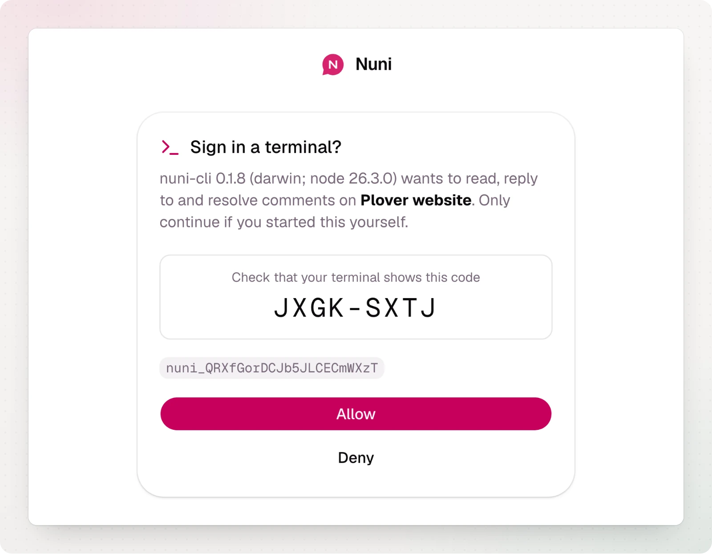

A comment in Nuni carries the context an agent needs: the page, the element (text, selectors, React component), its markup and styles, console errors, failed requests and a screenshot. There are three ways to hand it over.

## Copy for agent

Open a comment in the widget (as the owner) or in the dashboard and choose **Copy for agent**. Paste it into your agent. Nothing to install.

## Sign in once

The CLI and the MCP server read comments as the project owner. Sign in from the project folder:

```bash
npx @nuniapp/cli@latest login
```

It prints a link and a short code. Open the link (on any device), check that the code matches, and choose **Allow**. If nobody owns the project yet, you claim it at the same time. This works over SSH and in cloud sandboxes, since nothing has to call back to your machine.



The session is saved in `~/.config/nuni/credentials.json` (readable only by you) for 90 days. The project is the `nuni_` ID in your code; pass `--project nuni_...` if there is more than one. In CI, set `NUNI_TOKEN` instead. Sign out with `npx @nuniapp/cli@latest logout`, or revoke the session in the project settings in the dashboard.

## MCP server

Add Nuni to your agent once. It runs `npx @nuniapp/cli@latest mcp` in your project folder.

<Tabs>
  <Tab title="Claude Code">
    ```bash
    claude mcp add nuni -- npx -y @nuniapp/cli@latest mcp
    ```
  </Tab>
  <Tab title="Cursor">
    ```json .cursor/mcp.json
    {
      "mcpServers": {
        "nuni": { "command": "npx", "args": ["-y", "@nuniapp/cli@latest", "mcp"] }
      }
    }
    ```
  </Tab>
  <Tab title="Codex">
    ```toml ~/.codex/config.toml
    [mcp_servers.nuni]
    command = "npx"
    args = ["-y", "@nuniapp/cli@latest", "mcp"]
    ```
  </Tab>
  <Tab title="Other">
    Any MCP client with stdio servers: the command is `npx`, the arguments are `-y @nuniapp/cli@latest mcp`. Add `--project nuni_...` if the agent doesn't start in your project folder.
  </Tab>
</Tabs>

Then ask your agent something like _"fix the open Nuni comments"_. The tools:

| Tool               | What it does                                                                                      |
| ------------------ | ------------------------------------------------------------------------------------------------- |
| `list_comments`    | Open (or resolved) comments, newest first, optionally for one page and grouped by page or element |
| `search_comments`  | Comments with these words in them or from this author, best match first                           |
| `list_pages`       | The pages with open comments, and how many each has                                               |
| `get_comment`      | One comment with all of its context, plus the screenshot as an image                              |
| `reply_to_comment` | Reply in the thread, as the owner                                                                 |
| `resolve_comment`  | Resolve it, optionally with a note saying what changed                                            |
| `resolve_comments` | Resolve several at once, for example everything one change fixed                                  |
| `reopen_comment`   | Reopen it                                                                                         |

Grouping helps with requests like _"fix all the comments on /pricing"_: comments on the same element (the same button, heading or sentence) are listed together, so one change can fix them all.

If the agent isn't signed in, the tools say so and ask you to run `login`.

## From the terminal

```bash
npx @nuniapp/cli@latest comments                  # open comments, newest first
npx @nuniapp/cli@latest comments --page /pricing  # one page
npx @nuniapp/cli@latest comments --search "typo"  # best match first
npx @nuniapp/cli@latest comments --group element  # related comments together
npx @nuniapp/cli@latest pages                     # pages with open comments
npx @nuniapp/cli@latest comment <id>              # everything about one comment
npx @nuniapp/cli@latest comment <id> --save-screenshot .
npx @nuniapp/cli@latest reply <id> "Fixed in the next deploy"
npx @nuniapp/cli@latest resolve <id> --note "Made the button bigger"
npx @nuniapp/cli@latest resolve <id> <id> --note "Fixed both typos"
```


Add `--json` to any command for machine-readable output.
