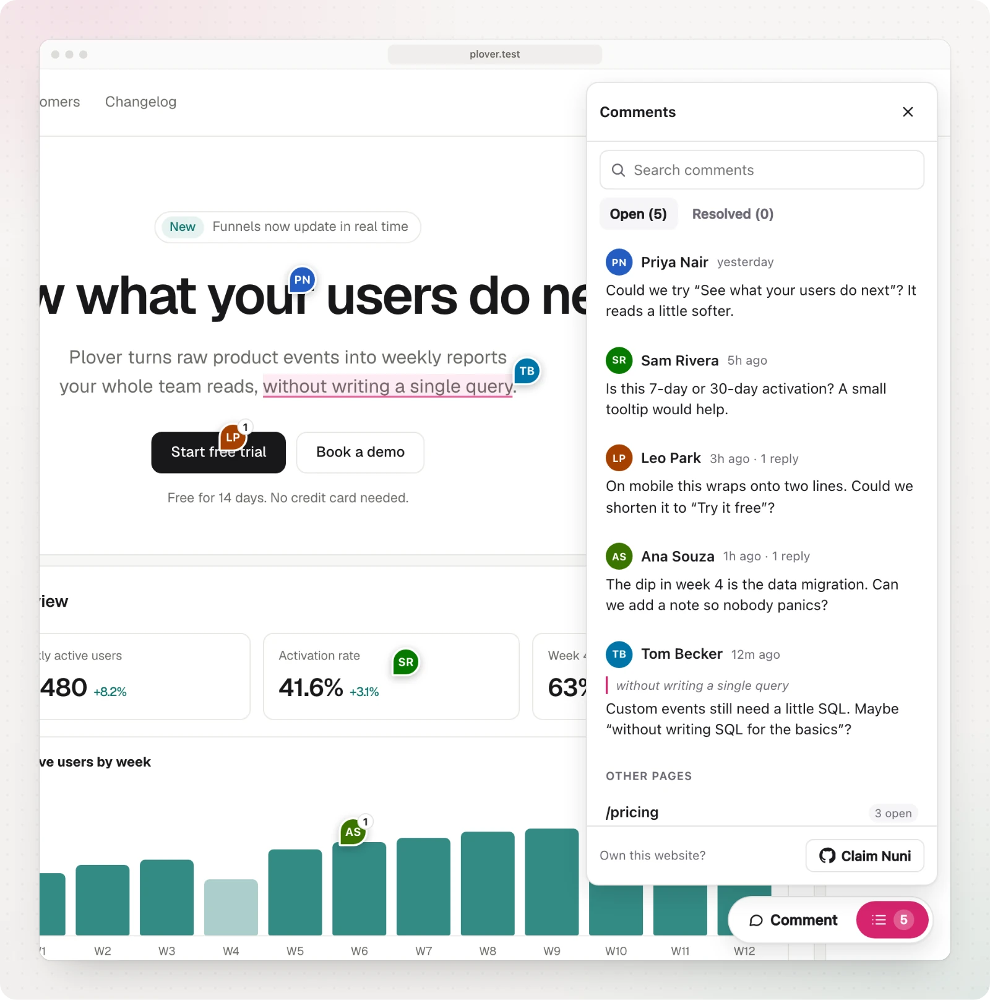
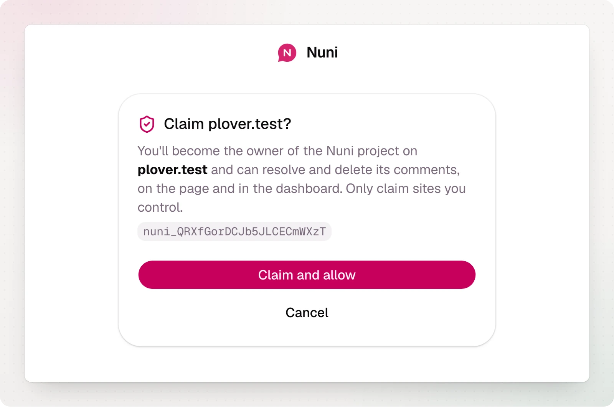
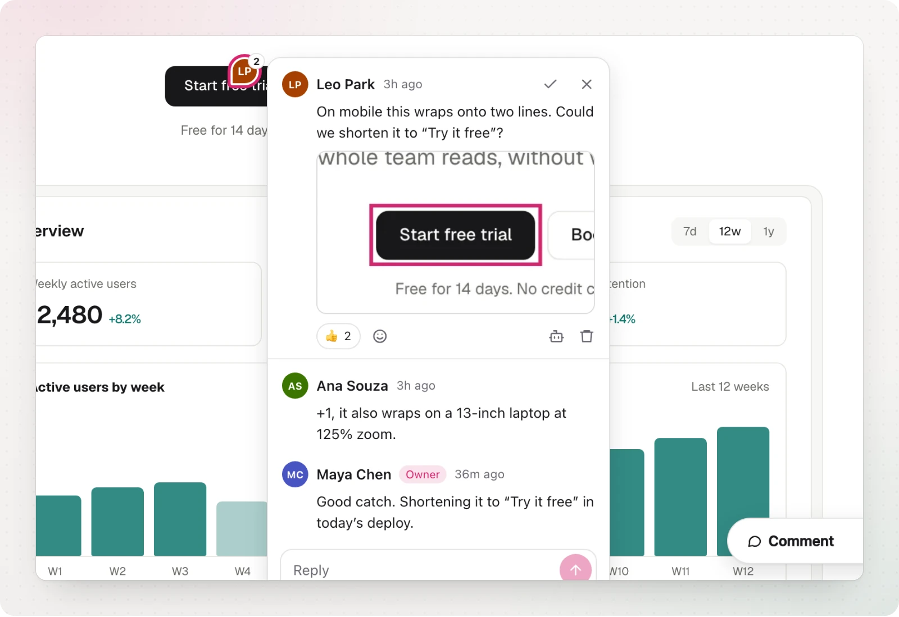

A Nuni project is created automatically, unclaimed, the first time the widget loads with a new project ID. Anyone can comment right away.

## Claim it

1. Open your site and click the list icon in the Nuni toolbar.
2. Choose **Claim Nuni** at the bottom of the panel.
3. Sign in with GitHub in the popup.
4. Choose **Allow on your-site.com** to turn on owner tools on that site.

The project is now yours. There is no DNS or file verification.

:::warning
Claiming is first come, first served. Claim your project as soon as you add Nuni, especially before sharing a production URL.
:::

## Owner tools

On any origin you allowed, the widget shows **Resolve**, **Reopen** and **Delete** on every comment, and **Move pin** to point a comment at another element. When a comment's element is gone from the page, it also offers **Close as outdated**. Each allowed browser gets its own session token (valid for 30 days). The claim prompt disappears for everyone once the site is claimed.

The [dashboard](/dashboard) lists all your projects and every comment, with filters by page and environment and a **Jump to comment** link that opens the page with the comment focused.

## Changing owners

Someone else claimed your site first, or you are handing a project over? The owner can [transfer it](/guides/dashboard#settings) from the project's settings with a one-time link, or release it so it can be claimed again.

## Before claiming

Unclaimed projects are kept, but limited to 500 comments. Claiming removes the cap.
