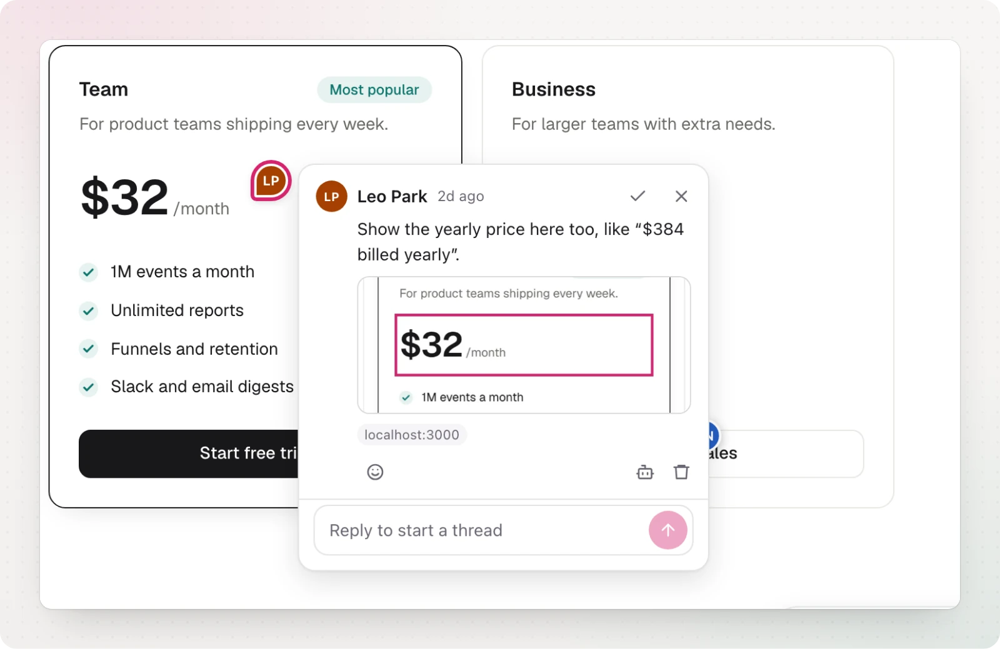

Use the **same project ID everywhere**. Comments are matched by **page path**, not by domain, so a comment left on `localhost:3000/pricing` also shows on `preview-123.vercel.app/pricing` and on `example.com/pricing`.

Each comment remembers where it was left. When you view it on a different environment, it shows a small badge with the original host, and the dashboard can filter by environment.



## Which URLs share comments

By default the path is normalized: the query string and `#section` hashes are ignored, trailing slashes and `index.html` are dropped, and hash-router paths (`/#/settings`) are kept. To change this, pass `getPageKey`:

```ts
init({
  project: "nuni_...",
  // Keep ?tab=... so each tab has its own comments
  getPageKey: (url) =>
    url.pathname +
    (url.searchParams.has("tab") ? `?tab=${url.searchParams.get("tab")}` : ""),
})
```
