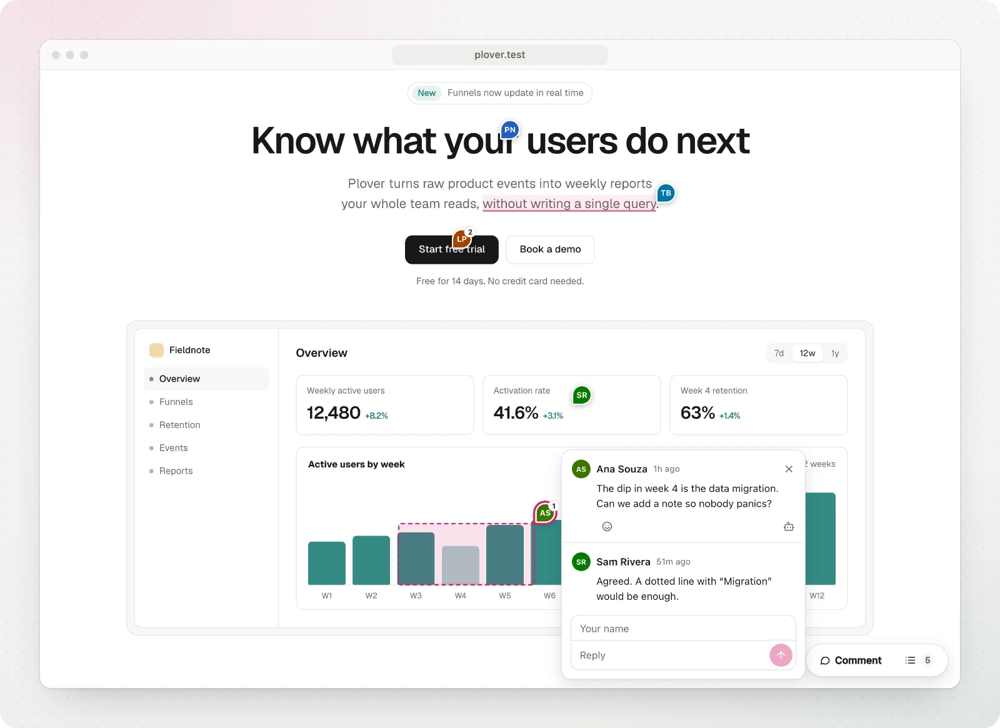

Reliable pins are the heart of Nuni. A comment is only useful if it is still attached to the right thing after the next deploy.

## What is stored

When you click an element, Nuni records several independent ways to find it again:

- **Selectors**: a stable `id`, a test id (`data-testid`, `data-test`, `data-cy`, `data-nuni`), the shortest unique CSS selector built from human-written classes and attributes, and a structural path.
- **Content**: the element's text, identifying attributes (`href`, `name`, `aria-label`, `alt`, `placeholder`), and a short text snippet from its closest containers (like the card title).
- **Geometry**: its box on the page, where inside it you clicked, the viewport size and scroll position.
- **Context**: the URL, page title, author, comment and time. In React apps, the component name too.

Generated class names (CSS modules, styled-components, emotion) and utility classes (Tailwind) are ignored, because they change between builds or say nothing about identity.

## How it is found again

Every candidate element is scored against all of these signals. Text is treated as identity for repeated items like list rows and cards; for one-off elements such as a hero button, the copy can change and the pin still follows.

If no element scores high enough, Nuni does **not** guess. The comment appears under **Couldn't find on this page** in the panel, with the text it was left on. The widget also tells the owner: the comment shows under **Not found** in the [dashboard](/guides/dashboard), until a visitor's browser finds the element again. The owner can then choose **Move pin** on the comment to point it at the element where it belongs now, or **Close as outdated** if it no longer applies. A pin on the wrong element is worse than no pin.

Pins also follow layout changes live: scrolling, resizing, responsive breakpoints, content loading in, and elements being moved or re-rendered.

## Text and area comments

Comments can point at less than a whole element:

- **Selected text.** Select words on the page, then click **Comment** under the selection or press <kbd>C</kbd>. Nuni stores the paragraph (or heading, list item, cell) holding the words, the words themselves, and a little text before and after them. The words are found again inside that element, and the text around them tells repeated words apart. If the words were edited, the closest match is shown and marked approximate. If the sentence moved to the next paragraph, the pin follows it. Commented words are underlined on the page.
- **A new wording.** On selected words, or on a small element like a button or a link, choose **Suggest an edit** in the comment box and type the new text. The comment shows the old words struck through and the new ones, a note is optional, and the owner (or their coding agent) can copy the new text straight into the code.
- **An area.** While picking, drag a box over part of a chart, an image or a layout (desktop only). The comment is pinned to the smallest element that covers the box, and the box is stored as a share of that element's size, so it scales with the layout. The box shows while the comment is open.

Text in [`data-nuni-mask`](/reference/options#page-context) areas is never stored, so masked text can't be quoted.

## Web components and iframes

You can comment on elements inside **open shadow roots** (web components, Lit, Stencil) and inside **same-origin iframes**. Nuni records each host or iframe on the way, the same way it records the element, and finds them level by level. Since look-alike components often contain identical elements, the host has to match too: if the card is gone, the pin is reported as not found rather than moved to the same button in another card. Closed shadow roots and cross-origin iframes can't be looked into, so a comment there pins to the host or the iframe itself.

Pages with hundreds of pins stay responsive: pins are placed in short slices while the browser is idle.

## Tested against real changes

Every change to the engine runs a benchmark of real-world page changes in Chromium: copy edits, translations, reordered and re-sorted lists, regenerated CSS-module classes, added wrappers, moved forms, duplicate cards, desktop to mobile, separate mobile and desktop menus, collapsed accordions, content pushed down by banners, web components, nested shadow roots, iframes, virtualized lists, deleted elements, and text comments whose paragraph was edited, reordered, wrapped in links or moved. It also places 200 pins on a 10,000-element page within a time budget. CI fails if fewer than 95% of pins land on the right element, or if more than one lands on the wrong one.

## Tips for rock-solid pins

- Add `data-testid` or `data-nuni` to elements that matter. They are the strongest signal.
- Stable, meaningful `id`s and class names help. Hashed ones are ignored.
