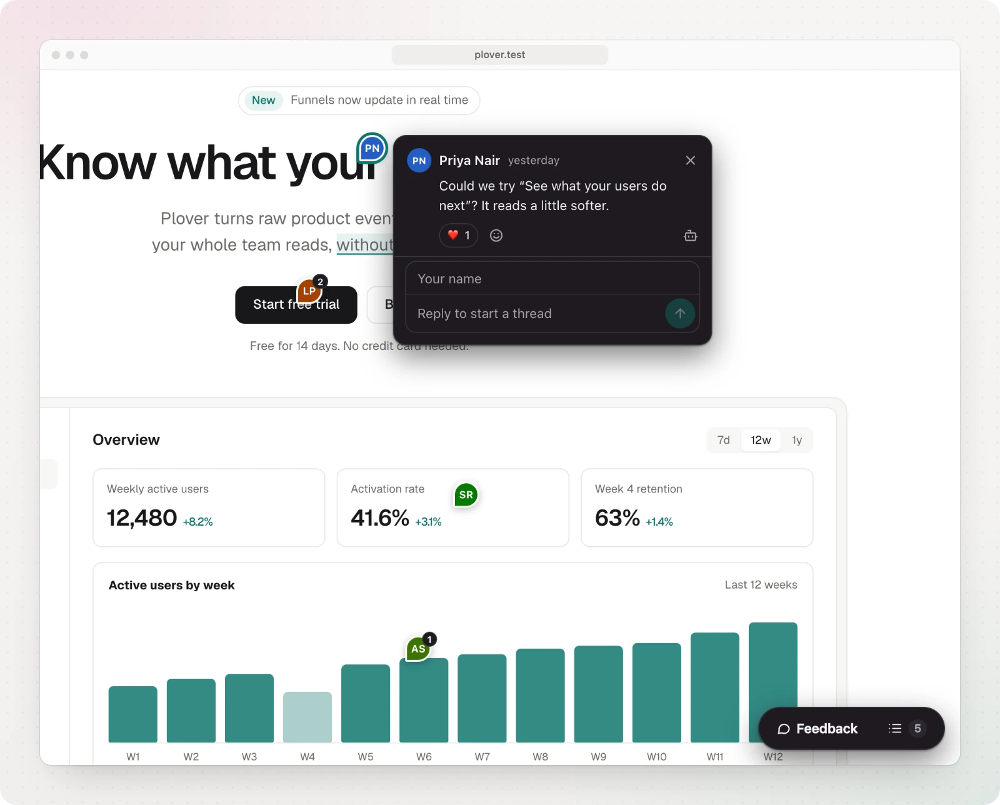

```ts
import { init } from "@nuniapp/widget"

const instance = init({
  project: "nuni_...", // required
})
instance.destroy()
```

<TypeTable
  type={{
    project: {
      type: "string",
      description: "Your public project ID. Commit it; it is not a secret.",
      required: true,
    },
    getPageKey: {
      type: "(url: URL) => string",
      description:
        "Which URLs share comments. Defaults to the normalized path.",
    },
    pageKey: {
      type: '"path" | "path+search" | "path+hash"',
      description:
        "A ready-made getPageKey: also tell pages apart by their query string (tracking parameters ignored) or their hash.",
      default: '"path"',
    },
    position: {
      type: '"bottom-right" | "bottom-center" | "bottom-left" | "top-right" | "top-center" | "top-left"',
      description:
        "Where the toolbar starts. Visitors can drag it to another corner or edge middle, and it stays there for them.",
      default: '"bottom-right"',
    },
    accentColor: {
      type: "string",
      description:
        "Any CSS color for buttons and highlights. Text on it turns black or white for contrast.",
    },
    theme: {
      type: '"auto" | "light" | "dark"',
      description: "auto follows the visitor's system setting.",
      default: '"auto"',
    },
    label: {
      type: "string",
      description: "Text on the toolbar's comment button.",
      default: '"Comment"',
    },
    hotkey: {
      type: "string | false",
      description: "The key that starts a comment. false turns it off.",
      default: '"c"',
    },
    zIndex: {
      type: "number",
      description: "Stacking order, if the widget has to sit below your UI.",
      default: "2147483646",
    },
    locale: {
      type: "string",
      description:
        'Language for times and counts, like "de". Defaults to the browser\'s.',
    },
    messages: {
      type: "Partial<Messages>",
      description: "Replace any of the widget's words. See below.",
    },
    convexUrl: {
      type: "string",
      description:
        "Self-hosting or local development: the Convex deployment URL.",
    },
    convexSiteUrl: {
      type: "string",
      description:
        "Self-hosting or local development: the Convex HTTP actions URL.",
    },
    appUrl: {
      type: "string",
      description:
        "Self-hosting or local development: where the dashboard is served.",
    },
    images: {
      type: "boolean",
      description:
        "Let commenters attach images and mark up the screenshot. They are public, like the comment. Claimed sites only.",
      default: "true",
    },
    capture: {
      type: "{ console?, network?, dom?, screenshot? }",
      description:
        "Page context attached to each comment for the owner. All on by default; set a key to false to turn it off.",
    },
  }}
/>

`<Nuni />` from `@nuniapp/react` takes the same props.

## Look and language

```tsx
<Nuni
  project="nuni_..."
  position="bottom-left"
  accentColor="#2563eb"
  theme="dark"
  label="Feedback"
  hotkey="f"
  locale="de"
  messages={{
    comment: "Kommentieren",
    post: "Senden",
    leaveComment: "Kommentar schreiben",
    replyCount: { one: "{count} Antwort", other: "{count} Antworten" },
  }}
/>
```



The full list of words is exported as `messages` from `@nuniapp/widget`. `{name}` parts are filled in, and a message with `one` and `other` forms (plus `zero`, `two`, `few` or `many` where a language has them) is picked by `{count}`. Shortcuts show <kbd>⌘</kbd> on Apple devices and <kbd>Ctrl</kbd> elsewhere.

With the script tag, use data attributes: `data-position`, `data-accent-color`, `data-theme`, `data-label`, `data-hotkey` (`"false"` turns it off), `data-z-index`, `data-locale`, `data-page-key` and `data-images` (`"false"` turns images off).

## Page context

Each comment carries context that only the project owner can see (details on the [privacy page](/privacy)):

| Key          | What is captured                                                                                                               |
| ------------ | ------------------------------------------------------------------------------------------------------------------------------ |
| `screenshot` | An image of the element with a small margin, shown to the commenter before posting. Loaded on demand so the widget stays small |
| `console`    | The latest console errors and warnings                                                                                         |
| `network`    | The latest failed requests (method, status, origin and path)                                                                   |
| `dom`        | The element's markup, without form values, and key computed styles                                                             |

With the script tag, use data attributes: `data-capture-screenshot="false"`, `data-capture-console="false"`, `data-capture-network="false"` and `data-capture-dom="false"`.

Form fields are always painted over, and any element with `data-nuni-mask` is hidden from the screenshot, the markup and the pin's stored text:

```html
<section data-nuni-mask>…private details…</section>
```

## Keyboard

| Key                                                  | Action                                                            |
| ---------------------------------------------------- | ----------------------------------------------------------------- |
| <kbd>C</kbd> (the `hotkey`)                          | Start or stop adding a comment, or comment on the selected text   |
| Arrow keys, <kbd>Enter</kbd>                         | While adding: move to the parent, child or sibling; comment on it |
| <kbd>Esc</kbd>                                       | Cancel, close the comment, then the panel                         |
| <kbd>Cmd</kbd> or <kbd>Ctrl</kbd> + <kbd>Enter</kbd> | Post the comment                                                  |
